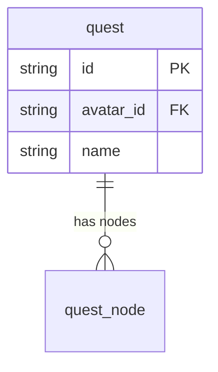
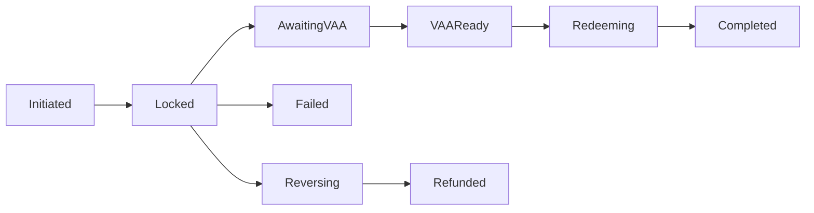

# DESIGN — Mermaid Portfolio as Schema Source of Truth

**Status:** Design doc. Created 2026-05-27. **Not yet implemented.**
This document specifies the model we will build against; code lands in
subsequent slices once the design has been reviewed.

## TL;DR
Mermaid stays the authoring surface — but we use **multiple Mermaid
diagram types together** as the source of truth, not just `erDiagram`.
Each source file can hold a portfolio of diagrams; the parser
dispatches by diagram type; generators consume whichever types they
need.

The promise: a single `oasis-surreal` regen takes
`schema/<domain>.mermaid` files and emits the schema (`.surql`), typed
client (C# POCOs), state-machine code (enums + transition
validators), test scaffolds for stated invariants, the master
visualization, and a drift report.

## Why this shape

Phase B shipped today (`137992c`) was the realization that "the data
model" isn't expressible in one diagram. It's at least three diagrams:

1. **Entity shape + FK relationships** → `erDiagram`
2. **State machines + control flow** → `flowchart`
3. **Guardrails / invariants / requirements** → `requirementDiagram`

The OASIS codebase has all three today, baked into different artifacts:

| What | Today's location | The right diagram type |
|---|---|---|
| Quest `state` enum + valid transitions | Hand-written in `QuestManager.cs` + `quest_node_execution.surql` ASSERT INSIDE list | `flowchart` |
| `bridge_tx.status` enum + transitions | Hand-written in `CrossChainBridgeService.cs` + `bridge_tx.surql` ASSERT | `flowchart` |
| G1–G7 guardrails + which entities satisfy them | Prose in `RESIDUAL-RISK-RUNBOOK.md` + `@surreal.guardrail` annotations | `requirementDiagram` |
| Entity shape + FK | `.mermaid` `erDiagram` blocks | `erDiagram` (current) |

Today we have three sources of truth for the state machines (the C#
switch, the SurrealDB ASSERT, the prose note) and they drift. The
mermaid-portfolio model collapses them into one authored artifact +
generated downstream.

## The portfolio

### erDiagram — Entity & FK (today's model, unchanged)
What's already there. Entities, attributes, indexes, FK arrows,
slice annotations.



### flowchart — State machines
Each flowchart in a schema file declares one state machine. Nodes are
states; edges are valid transitions. The diagram is bound to an
entity-attribute pair via a header annotation.



**Generator outputs (per state machine):**
- C# `enum BridgeStatus { Initiated, Locked, AwaitingVAA, ... }` —
  members enumerated from the flowchart nodes.
- C# `static class BridgeStatusTransitions { public static bool
  IsValid(BridgeStatus from, BridgeStatus to) => (from, to) switch
  { ... }; }` — exhaustive switch from the flowchart edges.
- `.surql` `ASSERT $value INSIDE [...]` on the bound field — values
  enumerated from flowchart nodes.
- (Optional) test scaffold asserting `IsValid(X, Y) == true/false` for
  every (from, to) pair the flowchart covers.

**Eliminated drift:** `BridgeStatusTransitions.IsValid` switch and the
`.surql` ASSERT and the C# enum can no longer disagree — they're all
emitted from one flowchart.

### requirementDiagram — Guardrails & invariants
Each requirement is a named invariant; `satisfies` edges link
implementations (entities, modules, tests) to the requirement they
honor.

```mermaid
requirementDiagram
    requirement G2_exactly_once {
        id: G2
        text: "Concurrent claim attempts produce exactly one winner."
        risk: high
        verifymethod: test
    }

    element idempotency_key_store {
        type: surreal-table
    }

    element TryClaimDueStepAsync {
        type: csharp-method
        docref: Services/Sagas/SurrealSagaStore.cs:187
    }

    element G2_IdempotencyTocTouTest {
        type: integration-test
    }

    idempotency_key_store - satisfies -> G2_exactly_once
    TryClaimDueStepAsync   - satisfies -> G2_exactly_once
    G2_IdempotencyTocTouTest - satisfies -> G2_exactly_once
```

**Generator outputs:**
- A `RESIDUAL-RISK-RUNBOOK.generated.md` traceability table (every
  requirement + every element satisfying it + file paths).
- (Optional) test scaffolding: for every `satisfies` edge with
  `verifymethod: test`, the generator can emit a `[Fact(Skip="not yet
  implemented")]` stub when the named test class doesn't exist yet.
- Drift detection: if an element named in a `satisfies` edge no longer
  exists (file path missing / method renamed), the generator warns.

**Eliminated drift:** the prose runbook can no longer claim a
guardrail is satisfied by code that doesn't exist.

### Existing directives carry forward
`@surreal.slice`, `@surreal.schemafull`, `@surreal.assert`,
`@surreal.index`, `@surreal.csharp.*`, `@surreal.fieldgroup`, etc. all
continue to work on `erDiagram` blocks as they do today.

## Parser model

### Top-level type changes
- `MermaidSchemaModel` is renamed `MermaidPortfolioModel` (or kept as
  an alias for back-compat during transition).
- A `MermaidPortfolioModel` holds:
  - `IReadOnlyList<ErDiagram>` — what we have today
  - `IReadOnlyList<Flowchart>` — new
  - `IReadOnlyList<RequirementDiagram>` — new
  - `SourceFile`

### Parser dispatch
Today `ParseDocument` hard-fails on anything other than `erDiagram`
at line 1 ([MermaidParser.cs:110](packages/Oasis.SurrealDb.Schema/Mermaid/MermaidParser.cs#L110)).
Change:

```
ParseDocument(ctx):
    while !ctx.IsEnd:
        skip blanks + plain comments
        peek diagram header keyword:
            "erDiagram"          → erDiagrams.Add(ParseErDiagram(ctx))
            "flowchart"          → flowcharts.Add(ParseFlowchart(ctx))
            "requirementDiagram" → reqDiagrams.Add(ParseRequirementDiagram(ctx))
            "graph"              → flowcharts.Add(ParseFlowchart(ctx))  // mermaid alias
            else                 → parse error with context
```

Each diagram parser respects the existing annotation rules (drain
pending `@surreal.*` annotations, attach to the next node). Each
diagram terminates when the next diagram header keyword appears OR at
EOF.

### New annotations

**Header-level on a `flowchart` block:**
- `@surreal.state-machine entity=<table> field=<column>` — binds the
  flowchart to a (table, field) pair. Required for codegen; optional
  for docs-only flowcharts.

**Header-level on a `requirementDiagram` block:**
- `@surreal.requirements` (positional, no args) — marks the diagram as
  the canonical requirements registry. Optional; multiple requirement
  diagrams can coexist (e.g. per-slice).

**Inside `requirement <name> { ... }` blocks (mermaid-native, no
@surreal. needed):**
- `id`, `text`, `risk`, `verifymethod` — standard mermaid requirement
  fields, preserved verbatim into the generator output.

**Inside `element <name> { ... }` blocks (mermaid-native):**
- `type`, `docref` — standard mermaid element fields. `docref` is a
  free-form path/URL the drift checker validates.

### KnownDirectives addition
- `state-machine` — header-level flowchart binding
- `requirements` — header-level requirementDiagram marker

(Plus the existing `slice`, `schemafull`, `assert`, `index`, etc.)

## File layout

Per the user steer: **one main + many domain files; author's choice**.

```
schema/
    main.mermaid        # datasource + generator declarations only (no models)
    quest.mermaid       # erDiagram + flowchart(s) + requirementDiagram for quest
    bridge.mermaid      # erDiagram + bridge_tx flowchart + bridge requirements
    identity.mermaid    # avatar / holon / api_key / star_odk erDiagram
    ...
```

OR the single-file case:

```
schema/
    main.mermaid        # everything
```

The CLI globs `schema/*.mermaid`. `main.mermaid` is *conventional*,
not magic — it's just where datasource + generator declarations
typically live, but they can also live inline at the top of any
file.

### main.mermaid shape
This is where the file format diverges from "pure Mermaid." `main`
doesn't hold a Mermaid diagram; it holds **TOML-like config blocks**
in Mermaid-comment camouflage so existing Mermaid renderers don't
choke:

```
%% @surreal.datasource db
%%   provider = "surrealdb"
%%   url      = env("SURREAL_URL")
%%   namespace = env("SURREAL_NS")
%%   database  = env("SURREAL_DB")
%% @surreal.datasource end

%% @surreal.generator surql
%%   provider = "surrealql"
%%   output   = "Persistence/SurrealDb/Schemas"
%% @surreal.generator end

%% @surreal.generator pocos
%%   provider = "csharp-poco"
%%   output   = "Generated/SurrealDb"
%%   namespace = "OASIS.WebAPI.Generated.SurrealDb"
%% @surreal.generator end

%% @surreal.generator viz
%%   provider = "mermaid-aggregates"
%%   output   = "docs"
%% @surreal.generator end
```

Alternative considered: put these in a sibling `schema/main.toml` or
`oasis-surreal.config.json`. Rejected because the user wants
single-file authoring as a first-class option, and a sibling config
file forces two-file even for the simple case. The Mermaid-comment
camouflage keeps the file renderable everywhere while carrying our
own metadata.

## File migration from current state

Phase B's current layout:

```
Persistence/SurrealDb/Schemas/source/
    010_wallet.mermaid              (one entity, with @surreal.slice "wallet_nft")
    020_bridge_tx.mermaid           (one entity, with @surreal.slice "bridge")
    ...
    240_hnsw_indexes.mermaid        (two pseudo-entities, slice "_skip")
```

The portfolio model's target layout consolidates per slice:

```
schema/
    main.mermaid               (datasource + generators)
    quest.mermaid              (was 130/140/150/160/170/180/190/200/230, ~8 files into 1)
    quest_templates.mermaid    (was 130/140 — could fold into quest.mermaid if desired)
    bridge.mermaid             (was 020/050/060/070/080, ~5 files into 1)
    wallet_nft.mermaid         (was 010/030/040, ~3 files into 1)
    identity.mermaid           (was 090/100/110/120, ~4 files into 1)
    dapp_composition.mermaid   (was 210/220, 2 files into 1)
    hnsw_indexes.mermaid       (was 240, special — kept separate, not a slice)
```

The migration is mechanical: concatenate the per-entity files within
each slice into one file per slice. The slice annotation moves to a
file-level convention or stays per-entity (both work).

**The `NNN_` numeric prefix** was an artifact of the `.surql` apply
ordering and is no longer needed at the source layer — the generator
emits `.surql` with the prefix derived from a *generator-side ordering
declaration*, not from filenames. Source files are named for human
readability.

## Generator contracts

### 1. `surrealql` generator (existing, renamed conceptually)
- Reads: all `erDiagram` blocks across all schema files. Reads
  bound `flowchart` state machines to derive ASSERT INSIDE values.
- Emits: `<output>/NNN_<table>.surql` files. Ordering from a
  declaration in `main.mermaid` `@surreal.generator surql` block.

### 2. `csharp-poco` generator (existing — `surrealdb-schema-source-gen`)
- Reads: all `erDiagram` blocks (entity shapes) + bound `flowchart`
  state machines (enum members) + `requirementDiagram` element
  metadata (for `docref` cross-links).
- Emits: POCO `<table>.g.cs`, typed query `<table>QueryBuilder.g.cs`,
  enums `<state-machine>Status.g.cs`, transition validators
  `<state-machine>StatusTransitions.g.cs`.

### 3. `mermaid-aggregates` generator (Phase B today)
- Reads: all diagrams across all schema files. Groups by slice.
- Emits: `docs/aggregates/<slice>.mermaid` (per-slice portfolio:
  the erDiagram subset of entities for that slice + bound flowcharts
  for those entities + per-slice requirements) and the master
  `docs/domain.generated.mermaid`.

### 4. `requirements-runbook` generator (new)
- Reads: all `requirementDiagram` blocks.
- Emits: `docs/RESIDUAL-RISK-RUNBOOK.generated.md` — traceability
  table linking every requirement to its satisfying elements with
  file references.

### 5. `drift-check` generator (planned, surrealql-drift-detection track)
- Reads: deployed DB schema + all `erDiagram` blocks + bound flowchart
  ASSERT-INSIDE values.
- Emits: drift report; exit 0/1 on detected drift.

### 6. `data-backfill-shell` generator (planned, data-backfill-migrations track)
- Reads: schema diff between current `erDiagram` and the previous
  committed `erDiagram` (via git).
- Emits: stub `IBackfill` class for every field-type change so authors
  fill in the rewrite logic.

Each generator runs independently; `oasis-surreal generate` runs all
configured ones.

## CLI shape (revised)

```
oasis-surreal init                 # scaffold schema/main.mermaid + first slice file
oasis-surreal generate             # run all configured generators
oasis-surreal generate --only=surql,pocos
oasis-surreal migrate apply        # apply pending .surql migrations (existing)
oasis-surreal migrate status
oasis-surreal drift                # diff deployed vs schema (planned)
oasis-surreal db pull              # reverse-engineer schema from DB (planned)
oasis-surreal backfill list/apply  # data backfills (planned)
oasis-surreal validate             # parse + lint all schema files
oasis-surreal aggregates           # (deprecated alias for `generate --only=aggregates`)
```

## What goes where in this commit's deliverables

This design doc lands now. Implementation lands in slices:

| Slice | Scope | Effort |
|---|---|---|
| **C-1 parser dispatch** | `MermaidPortfolioModel` + parser handles `erDiagram` / `flowchart` / `requirementDiagram` blocks in sequence. Existing `MermaidSchemaModel` stays as a view over the erDiagrams. | 3-4h |
| **C-2 state-machine codegen** | Flowchart parser + `@surreal.state-machine` binding + enum/transition emitter. First consumer: bridge_tx + quest_run + quest_node_execution. | 3-4h |
| **C-3 requirementDiagram support** | Parser + RESIDUAL-RISK-RUNBOOK generator. First consumer: G1–G7 from `api-safety-hardening`. | 2-3h |
| **C-4 main.mermaid + generator orchestration** | `main.mermaid` config parser + `generate` orchestrator that drives all configured generators. | 2-3h |
| **C-5 file consolidation** | Migrate 24 single-entity source files into 6 per-slice files. Idempotent: byte-identical generator outputs before/after. | 2h |
| **C-6 retire `aggregates` subcommand** | Fold into `generate --only=aggregates`; keep alias for back-compat. | 30min |

Total Phase C scope: ~13-17h, much bigger than the original §6 Phase
C estimate (4-6h). Worth it for the strategic alignment.

## Open questions
1. **Multiple flowcharts per state machine?** A single state machine
   might want to be sliced across multiple flowcharts (e.g. the
   normal path + the compensation path). Resolution: same
   `@surreal.state-machine entity=X field=Y` header on multiple
   flowcharts unions their edges. Document the union semantics.
2. **Cross-file requirementDiagram elements.** A requirement defined
   in `bridge.mermaid` might be satisfied by an element in
   `quest.mermaid` (cross-domain invariant). Resolution: the
   portfolio model is global across all schema files; elements and
   requirements share a global namespace. Document the precedence
   on name conflicts.
3. **Backwards compatibility during migration.** The current 24
   single-entity files have `@surreal.slice` annotations + relationship
   arrows that the portfolio parser will need to accept verbatim
   until file consolidation (C-5) lands. The parser is built
   additively — new diagram types are additive, current shape
   continues to work.
4. **Should `main.mermaid` config use a real config format (TOML/JSON)
   inside fenced blocks?** Currently I proposed Mermaid-comment-prefixed
   key=value pairs. Alternative: `%% @surreal.config begin TOML` …
   `%% @surreal.config end` framing a literal TOML body. More familiar
   to authors; one more parser layer. Open.

## Non-goals
- Replacing Mermaid with a bespoke DSL. The portfolio model gets us
  Prisma-grade expressiveness without leaving the Mermaid ecosystem.
- Editor-side IntelliSense beyond what Mermaid provides natively.
  Tooling can layer on later.
- Multi-language schema source files (e.g. some files .mermaid, some
  files .prisma). Stay in one format.

## References
- [RUNBOOK §4](../../RUNBOOK.md) — Phase B (shipped) + Phase C
  (rethought scope per this doc)
- [surrealql-toolkit spec.md](spec.md) — strategic ADR (this doc
  refines the constituent shape)
- [Prisma multi-file schema docs](https://www.prisma.io/docs/orm/prisma-schema/overview/location#multi-file-prisma-schema)
  — the prior art that prompted the rethink
- [Mermaid requirementDiagram](https://mermaid.js.org/syntax/requirementDiagram.html)
- [Mermaid flowchart](https://mermaid.js.org/syntax/flowchart.html)
- [Mermaid erDiagram](https://mermaid.js.org/syntax/entityRelationshipDiagram.html)
