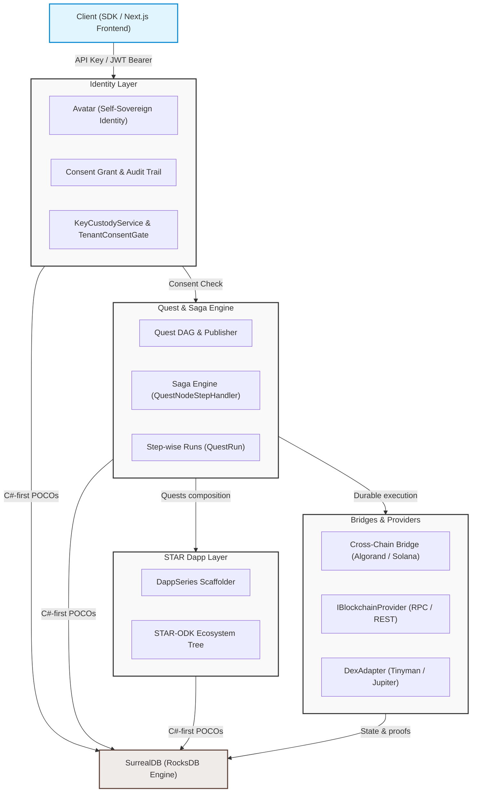
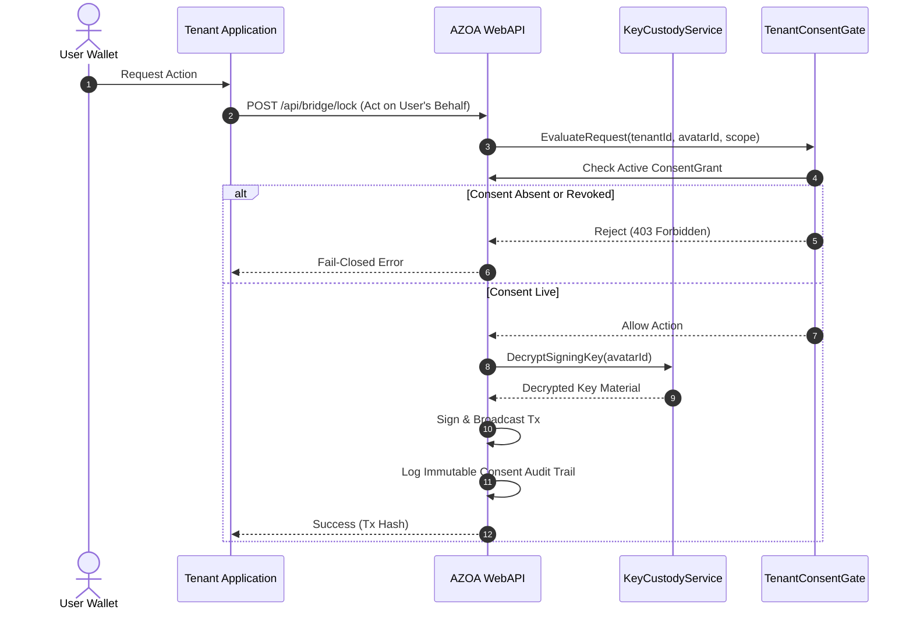
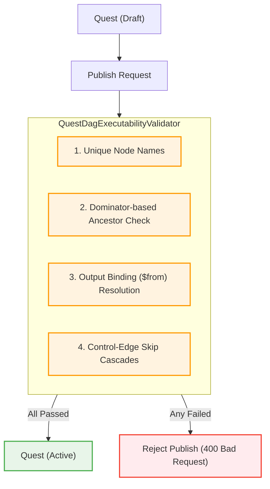
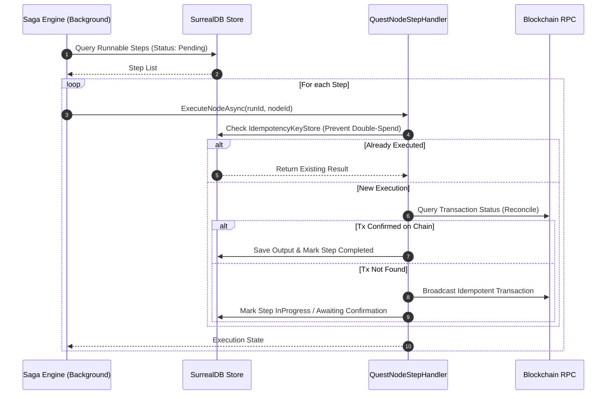
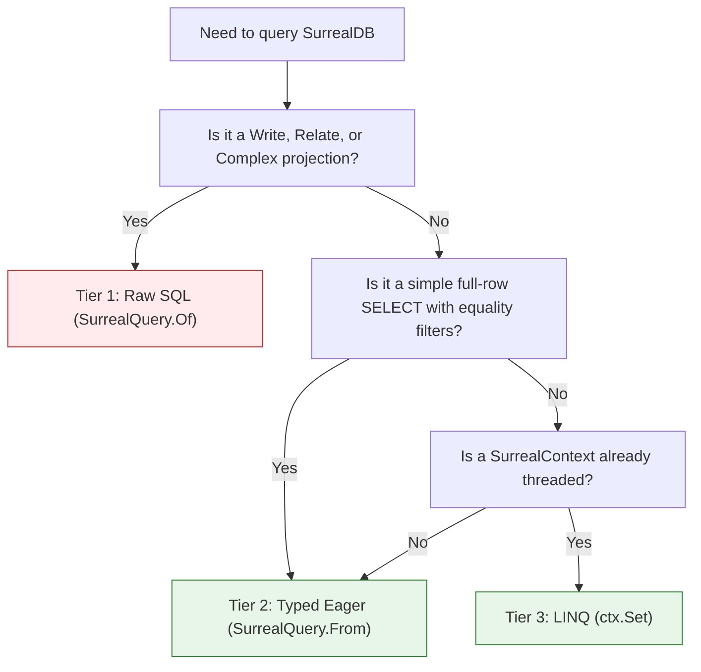

# AZOA Developer Documentation

Welcome to the AZOA developer documentation. This document serves as a comprehensive guide to the system architecture, core service interactions, persistence patterns, and developer workflow conventions of the AZOA (Autonomous Zones of Action) platform.

For local development environment setup, docker-compose runtime commands, and troubleshooting, refer to [DEVELOPMENT.md](../DEVELOPMENT.md).
For production deployment checklists, secrets audits, and operations tasks, refer to [RUNBOOK.md](../RUNBOOK.md).

---

## 1. System Architecture Overview

AZOA is designed as a modular, layered engine for executing durable, structured financial workflows. The system is split into three core layers and connected to external networks through pluggable provider adapters:



### Core Layers
1. **Identity (Self-Sovereign Auth)**: Users own their avatars, authenticating via cryptographic challenge-signatures from external wallets (ED25519/Secp256k1). Access is managed through explicit, revocable `ConsentGrant` scopes rather than hard-coded tenant roles.
2. **Quests (Durable Workflows)**: Structured, idempotent state machines represented as Directed Acyclic Graphs (DAGs). Execution is managed stepwise by a background saga engine that reconciles against real-world chains before advancing.
3. **Dapps (STAR Composition)**: A composition layer allowing developers to bundle, sequence, and configure quests into unified `DappSeries` deployments.
4. **Bridges & Adapters**: Standardized interfaces (`IBlockchainProvider`, `DexAdapter`) connecting quests to decentralized finance (DeFi) rails like Algorand, Solana, and Wormhole.

---

## 2. Core Subsystem Workflows

### 2.1 Identity, Authentication, and Revocable Consent
AZOA avoids custodial identity. End-user avatars are self-sovereign; tenants can only act on behalf of an avatar if a valid `ConsentGrant` is present.



> [!IMPORTANT]
> The **Key Custody & Consent Gate** check is a mandatory chokepoint. Every transaction or value-movement action converges on `KeyCustodyService` and `TenantConsentGate`. If a consent check fails, the operation immediately fails closed.

- **JWT Auth**: Emitted upon successful wallet-challenge verification.
- **API Keys**: Carry specific capability scopes (e.g. `dapp:develop` for dApp builders). Keys support optional CORS validation via `AllowedOrigins` fields.

---

### 2.2 Quest Dag Publishing and Semantic Validation
Before a quest can transition from `Draft` to `Active` (which makes it startable by users), it must pass the `QuestDagExecutabilityValidator` publishing gate.



1. **Dominator-Based Validation**: The validator checks all `$from` output bindings (e.g. `run.NodeA.Field`). It uses dominator-tree analysis to guarantee that `NodeA` is a guaranteed ancestor along control flow paths.
2. **Control-Edge Skip Cascades**: If a conditional check (such as a Gate Check) fails, the "skipped" status cascades down control chains to prevent downstream payout nodes from executing.
3. **Immutability Gating**: Once a quest is `Active`, its structure (nodes, edges, dependencies) is immutable. Updates require publishing a new version or unpublishing when no runs are active.

---

### 2.3 Step-wise Saga Execution and State Recovery
Saga execution is stepwise and managed through the `QuestNodeStepHandler` dispatch loop.



> [!TIP]
> **Exactly-Once Guarantees**: A step must never write side effects without first writing an idempotency record and verifying on-chain truth. If a transaction's state is ambiguous, the system halts and escalates to the operators via `MANUAL INTERVENTION REQUIRED` logs rather than guessing or auto-reversing.

---

## 3. Database Conventions (SurrealDB)

AZOA uses **SurrealDB** as its sole data engine, operating with RockDB-backed G1 durability (RocksDB syncs its WAL per commit). Persistence logic is managed through the C#-first package suite `SurrealForge`.

### 3.1 C#-First Schema Definition
We define the database schema directly inside C# POCOs under `Persistence/SurrealDb/Models/`. Hand-authoring `.surql` schema files is strictly prohibited.

```csharp
[SurrealTable("wallet", Schemafull = true)]
[Slice("wallet_nft")]
public partial class Wallet : ISurrealRecord
{
    public const string SchemaNameConst = "wallet";
    public string SchemaName => SchemaNameConst;

    [Column(Order = 1, Type = "string")]
    [JsonPropertyName("id")]
    public string Id { get; set; } = "";

    [Column(Order = 2, Type = "string")]
    [References(typeof(Avatar), Optional = false)]
    [JsonPropertyName("avatar_id")]
    public string AvatarId { get; set; } = "";

    [Column(Order = 3, Type = "string")]
    [JsonPropertyName("address")]
    public string Address { get; set; } = "";

    [Column(Order = 4, Type = "string")]
    [Inside("Algorand", "Solana", "Ethereum")]
    [JsonPropertyName("chain"), JsonConverter(typeof(JsonStringEnumConverter))]
    public ChainKind Chain { get; set; }
}
```

- **Attribute Mapping**:
  - `[SurrealTable]`: Defines table name, schema-full status, and index fields.
  - `[Column]`: Configures schema types (`string`, `record<avatar>`, `option<int>`).
  - `[References]`: Sets up schema foreign keys, mapped during DDL generation.
  - `[Inside]`: Restricts values to a closed-set enum.
- **Extensions**: Sibling partial classes (`Wallet.Extensions.cs`) host non-persisted accessors (like `Guid` parsing helpers) and domain predicates.

### 3.2 Drift Detection and Schema Sync
- **Byte-Equivalence Test**: `AttributePocoByteEquivalenceTests` reflects over compiled assemblies, emits schemas, and compares them byte-for-byte against committed `.surql` files. A test failure catches uncommitted schema changes.
- **Sync Command**: `surrealforge up` runs two-phase migrations:
  1. Applies generated schemas in lexical order (`DEFINE TABLE/FIELD IF NOT EXISTS`).
  2. Applies hand-authored data migrations under `Migrations/` (tracked in the `schema_migration` ledger).

### 3.3 Query Policy (Three-Tier Access)
To keep queries safe and structured, developers must follow the three-tier query selection guidelines:



- **Record Lookup Requirement**: When performing record lookups by string/Guid, always use `SELECT * FROM type::record($_t, $_id)` or the `SelectById(table, id)` helper. Thing vs string equality comparisons fail silently in SurrealDB 1.5.x.

---

## 4. Codebase Organization and Coding Style

### 4.1 Folder Structure by Role
AZOA organizes files strictly by role rather than domain:

- `/Controllers`: HTTP endpoints (JWT/API-Key validated).
- `/Managers`: Business orchestrators (Quest execution loops, dApp composition).
- `/Services/<domain>`: Emitters, adapters, blockchain network clients, and background workers.
- `/Core`: Primitives (enums, values, system-wide constants, exceptions, custom auth handlers).
- `/Persistence`: Database models, generated schemas, and SurrealDB setups.
- `/Providers`: Store implementations, blockchain providers (`Algorand`, `Solana`), and DEX adapters.
- `/Helpers`: Reusable static utility classes.
- `/Interfaces`: Pure interface definitions.

### 4.2 Coding Standards
- **Folder↔Namespace Mirroring**: Moving a file means updating its C# namespace to match its new physical location.
- **No Unused Usings**: Unused usings are promoted to **build errors** (`IDE0005`) in the `AZOA.WebAPI` project. Always run a clean build and remove flagged lines before committing.
- **Code Style Rules**: File-scoped namespaces, implicit typing (`var`), and expression-bodied members are configured as recommendations in the root `.editorconfig`.

---

## 5. Testing & Verification

### 5.1 Unit Tests
Unit tests reside in `tests/AZOA.WebAPI.Tests/`. These run entirely in-memory with mocked blockchain networks and zero external dependencies:
```powershell
dotnet test tests/AZOA.WebAPI.Tests/AZOA.WebAPI.Tests.csproj -c Debug
```

### 5.2 Integration Tests
Integration tests reside in `tests/AZOA.WebAPI.IntegrationTests/`. They require SurrealDB to be running locally (`./dev-up.ps1` starts this on port `8000`):
```powershell
dotnet test tests/AZOA.WebAPI.IntegrationTests/AZOA.WebAPI.IntegrationTests.csproj -c Debug
```

- **Namespace Isolation**: The test factory (`AZOATestWebApplicationFactory`) overrides `SurrealDb:Namespace/Database` dynamically for each class, isolating parallel test executions to prevent shared-state pollution.
- **Skippable Tests**: Integration tests that communicate with external sandbox chains are marked with `SkippableFact` and skip gracefully when external dependencies are unreachable.
